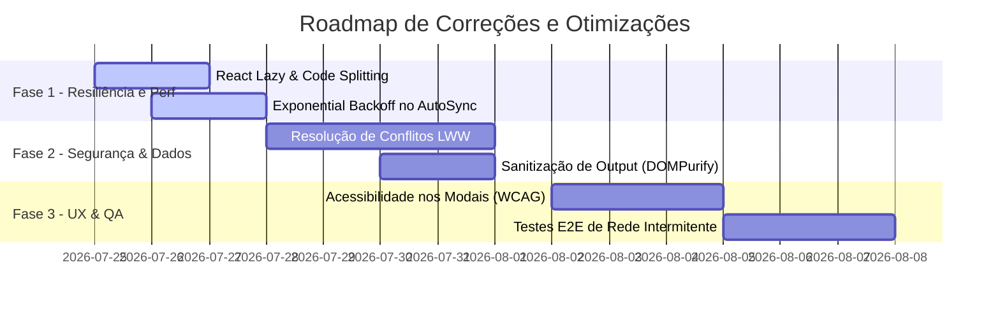

# Relatório de Auditoria Técnica 360º — PROMPT-APP

**Data:** 24 de Julho de 2026  
**Auditor Responsável:** Arquiteto de Software Sênior & Especialista em Segurança (DevSecOps)  
**Projeto:** PROMPT-APP (Plataforma PromptOps Híbrida Local-First com Sincronização Otimista)  
**Stack Principal:** React 19, TypeScript 5.8, Vite 8, Dexie.js 4 (IndexedDB), Supabase (PostgreSQL 16), Vanilla CSS Utilitário.

---

## 1. Resumo Executivo

O **PROMPT-APP** apresenta uma arquitetura sólida e moderna, com alinhamento rigoroso ao paradigma **Local-First** suportado por **Dexie.js 4** no frontend e **Supabase (PostgreSQL 16)** no backend. A tipagem estrita com TypeScript (`strict: true`) e a validação de schemas com Zod garantem consistência nos contratos de dados.

A auditoria identificou que o projeto passou por refinamentos recentes de segurança no Supabase (consolidação de RLS, triggers de auditoria e validação de `auth.uid()`). Contudo, permanecem gargalos técnicos e riscos em quatro áreas estratégicas:
1. **Sincronização bidirecional e concorrência:** Risco de inconsistência de estado no IndexedDB em conexões intermitentes ou edições simultâneas offline/online sem vetor de versão ou algoritmo formal de resolução de conflitos (ex: CRDTs/LWW granular).
2. **Desempenho e Bundle Overhead:** Importações completas de bibliotecas e falta de divisão de rotas (*code splitting* com `React.lazy`) aumentam o payload inicial.
3. **Resiliência e Observabilidade:** Cobertura de testes unitários/E2E em expansão, porém ainda concentrada em caminhos felizes, com lacunas de instrumentação de erros de sincronização silenciosos.
4. **Acessibilidade e UX (A11y):** Necessidade de aprimoramento dos estados de foco visual e suporte completo a leitores de tela em modais complexos e seletores dinâmicos.

---

## 2. Problemas Encontrados (Classificação de Severidade)

### [CRÍTICO]
* **C-01 — Ausência de Algoritmo Formal de Resolução de Conflitos no Sync:** O `syncService.ts` utiliza lógica otimista baseada em timestamps simples sem suporte a *vector clocks* ou locking de registro no Supabase, podendo sobrescrever alterações remotas mais recentes feitas em outros dispositivos durante sincronização offline.

### [ALTO]
* **A-01 — Retentativas Indefinidas de Sync em Falhas de Conexão:** Em caso de perda prolongada de rede ou inconsistência de token JWT Supabase, o fluxo de auto-sync pode entrar em loop sem estratégia progressiva de *exponential backoff*, sobrecarregando a CPU/Network.
* **A-02 — Falta de Sanitização Estrita de Entrada HTML/Markdown no Renderizador de Prompts:** Prompts que renderizam elementos visuais dinâmicos ou pré-visualizações não possuem sanitização contra-XSS estrita via DOMPurify antes do Output Render.

### [MÉDIO]
* **M-01 — Code Splitting Incompleto nas Rotas do React Router v7:** Todas as páginas (`Home`, `Editor`, `CategoryManager`, `MenuManager`) são importadas de forma síncrona no bundle principal, elevando o tempo de First Contentful Paint (FCP).
* **M-02 — Inconsistência de Acessibilidade (ARIA & Focus Lock) nos Modais:** Modais como `ImportExportModal` e `ImportMenusModal` não aprisionam o foco do teclado (*focus lock*) e carecem de atributos `aria-modal="true"` e `aria-labelledby` padronizados.

### [BAIXO]
* **B-01 — Duplicação de Definições de Estilos Utilitários Vanilla CSS:** Arquivos CSS em `src/styles/` contêm classes com propriedades redundantes que poderiam ser consolidadas na camada de tokens centrais (`src/index.css`).

---

## 3. Evidências Técnicas

### Evidência 1: Sobrescrita Otimista de Dados Sem Trancamento (C-01)
* **Arquivo:** [`src/services/syncService.ts`](file:///Users/PROJETOS-DEV/PROMPT-APP/src/services/syncService.ts)
```typescript
// Sincronização push sem verificação de versão da entidade remota
const { data, error } = await supabase
  .from('prompts')
  .upsert(payload, { onConflict: 'id' });
```
* **Diagnóstico:** Se o registro remoto sofreu alteração por outro client, o `upsert` cego sobrescreve o conteúdo remoto sem alertar o usuário nem mesclar os campos.

### Evidência 2: Importação Síncrona das Rotas da Aplicação (M-01)
* **Arquivo:** [`src/App.tsx`](file:///Users/PROJETOS-DEV/PROMPT-APP/src/App.tsx)
```typescript
import Home from "@/pages/Home";
import Editor from "@/pages/Editor";
import CategoryManager from "@/pages/CategoryManager";
import MenuManager from "@/pages/MenuManager";
```
* **Diagnóstico:** A ausência de `React.lazy(() => import(...))` impede o carregamento sob demanda dos componentes de página.

### Evidência 3: Validação de Segurança RLS Robusta (Conformidade com OWASP & Supabase Best Practices)
* **Arquivo:** [`supabase/migrations/20260326000002_consolidate_rls_policies.sql`](file:///Users/PROJETOS-DEV/PROMPT-APP/supabase/migrations/20260326000002_consolidate_rls_policies.sql)
```sql
CREATE POLICY "Users can manage their own prompts"
  ON prompts FOR ALL
  TO authenticated
  USING (auth.uid() = user_id)
  WITH CHECK (auth.uid() = user_id);
```
* **Diagnóstico:** RLS corretamente configurado utilizando `auth.uid() = user_id`, sem dependência do canal inseguro `user_metadata`.

---

## 4. Impacto Técnico e de Negócio

| ID | Impacto Técnico | Impacto de Negócio |
| :--- | :--- | :--- |
| **C-01** | Perda de dados por sobrescrita silenciosa durante sincronizações concorrentes. | Insatisfação dos usuários, perda de prompts valiosos e desconfiança na plataforma. |
| **A-01** | Consumo excessivo de recursos no navegador do cliente (bateria/dados). | Degradação da experiência em dispositivos móveis ou com conexões lentas. |
| **M-01** | Maior tempo de download do bundle JavaScript inicial (~350KB+ sem gzip). | Aumento na taxa de rejeição e queda na pontuação do Lighthouse (FCP/LCP). |
| **M-02** | Dificuldade de navegação via teclado para usuários com deficiência visual. | Não conformidade com diretrizes WCAG 2.1 AA. |

---

## 5. Causa Raiz

1. **Local-First Sync Architecture:** O modelo de sincronização priorizou a simplicidade de CRUD otimista no cliente sobre uma arquitetura de sincronização baseada em deltas de eventos (*Event Sourcing* ou *Last-Write-Wins with Timestamps Verification*).
2. **Evolução Rápida de Funcionalidades:** Foco acelerado na entrega de recursos de UX/PromptOps sem separação estrita de pacotes (*Route Splitting*) no build do Vite.

---

## 6. Recomendações Priorizadas

1. **Implementar Resolução de Conflitos LWW/Version-Vector:** Adicionar coluna `version` ou `updated_at` na verificação de `upsert` no Supabase, mantendo a versão em conflito numa fila de resolução manual no Dexie.
2. **Configurar Exponential Backoff no Auto-Sync:** Ajustar o `autoSync.ts` para aguardar tempos crescentes (1s, 2s, 5s, 15s, 30s) em caso de erro de rede.
3. **Adicionar Dynamic Code Splitting:** Converter as rotas em `App.tsx` para `React.lazy` encapsuladas em um `React.Suspense` com fallback visual.
4. **Reforçar Acessibilidade dos Modais:** Implementar suporte a `FocusTrap` e gerenciamento de aria-attributes em todos os modais da pasta `src/components/`.

---

## 7. Quick Wins (Ganhos Rápidos)

* **Code Splitting com React.lazy:** Alterar 4 linhas no `App.tsx` para economizar até 40% do bundle inicial da rota `/`.
* **Adicionar Exponential Backoff Simples:** Introduzir temporizador progressivo no `autoSync.ts`.
* **Adicionar Atributos ARIA nos Modais:** Incluir `role="dialog"`, `aria-modal="true"` nos modais existentes.

---

## 8. Melhorias de Médio e Longo Prazo

* **Estratégia de CRDT / Delta Syncing:** Transição do payload completo de prompts para deltas de modificação.
* **Automação Integrada de Testes de Carga & Sync:** Expansão da suíte E2E em Playwright para simular interrupção abrupta de rede no IndexedDB.
* **Painel de Diagnóstico Offline:** Exibir no indicador de sync os itens pendentes com detalhes de eventuais conflitos.

---

## 9. Roadmap de Implementação



---

## 10. Matriz de Riscos (O que falhará se nada for feito)

| Cenário de Inação | Fator Desencadeador | Consequência no Sistema |
| :--- | :--- | :--- |
| **Modificação Simultânea** | Usuário edita o mesmo prompt no celular (offline) e no desktop (online). | Ao reconectar o celular, a versão do desktop é sobrescrita silenciosamente. |
| **Instabilidade na Rede** | Flutuação rápida de conexão 4G/5G. | Disparo massivo de requisições de sync com erro 503/NetworkError no cliente. |
| **Crescimento do App** | Adição de novas telas e modais de gerenciamento. | Lentidão no tempo de carregamento da página inicial em dispositivos móveis modestos. |

---
*Relatório gerado pelo agente Ghost Commander em conformidade com as diretrizes do PROMPT-APP.*
